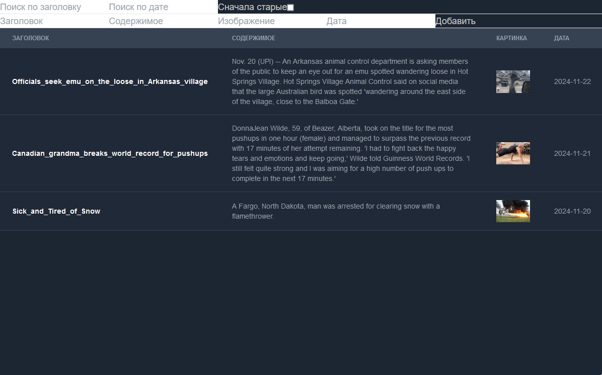
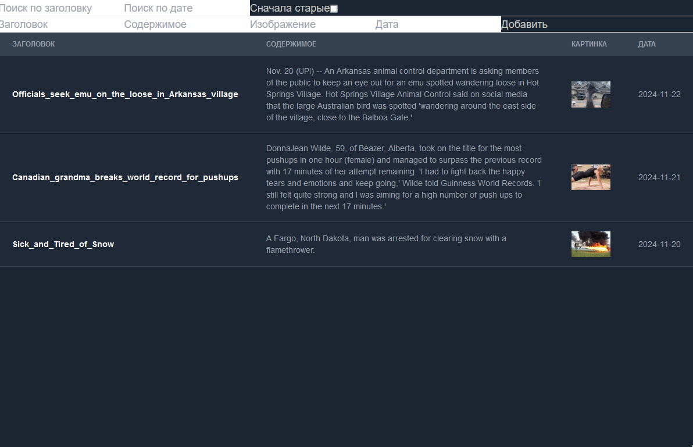
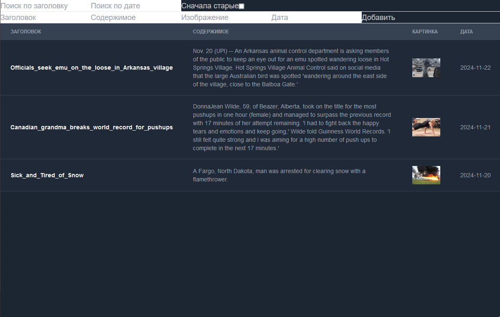
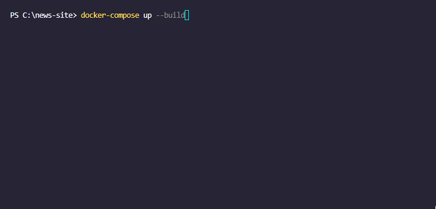

# Nextjs News Site

Новостной сайт, написанный на nexjs и использующий postgresql и prisma


## Отображение отдельной новости при помощи динамической страницы



## Сортировка и поиск новостей
- Сортировка по дате (старые/новые)
- Поиск по заголовку
- Поиск по дате



## Форма для добавления новостей



## Запуск проекта в Docker
```bash
  docker-compose up --build
```

